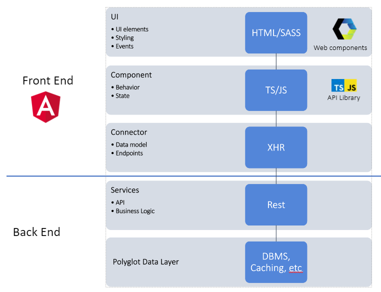
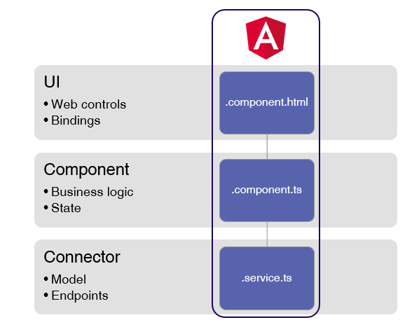

# Introduction

This repository is the base to understand why generated GeneXus Angular applications are high quality applications in terms of performance, consistency, maintainability and integration.

# Design Decisions

- The generator will allow the coexistence of generated code with manually written code.
- The generator will always be using the latest Angular and Typescript versions.
- Choose and mantain references to the best modules out there.
- Cross platform Node Scripts.
- Cross Framework Standard Classes to be shared between different Front-end generators (https://github.com/genexuslabs/web-standard-functions)
- Cross Framework UI Controls te be shared between different Front-end generators (https://github.com/genexuslabs/web-controls-library)
- 3 tier client generation (UI, Behavior, Data Connectors)

# Architecture 

 

# Current Power of the Generator

The Angular generator is a front-end generator. The generated objects run on the browser and communicate with the back-end on the server to get and send information.

The back-end is not generated by the Angular generator; instead, it is generated by one of the existing GeneXus generators, such as the Java, .Net or .NetCore generator. 

# Generated Source Code

Every GeneXus object is generated in a separate directory, where all the sources are grouped. This is under the <Model directory>\mobile\Angular\<main>\src\apps folder.
  
 

 For each panel, a component (the fundamental building block of Angular applications) is generated, which consists of three sources:

- *.component.html : is the layout of the panel. It is an Angular template that represents the layout of UI. It is mainly HTML 5 referencing webcomponents from the open source library of controls, and it adds elements and attributes that Angular interprets to perform the bindings with the data model and the specified UI events.

- *.component.ts 

is the particular logic of the panel. It is a TypeScript program. Events are generated here, and the state that is bound to the UI is manipulated here.

- *.sercvice.ts : is the layer responsible for interacting with the server. It is a Typescript program where communication with the server is generated. Here, the structures are also generated with the data model that the panel will use.

 
 
