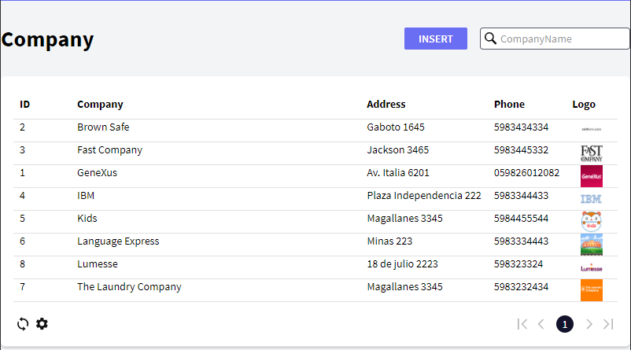

# Introduction

This repository is the base to understand why generated GeneXus Angular applications are high quality applications in terms of performance, consistency, maintainability and integration.

# Design Decisions

- The generator will allow the coexistence of generated code with manually written code.
- The generator will always be using the latest Angular and Typescript versions.
- Choose and mantain references to the best modules out there.
- Cross platform Node Scripts.
- Cross Framework Standard Classes to be shared between different Front-end generators (https://github.com/genexuslabs/web-standard-functions)
- Cross Framework UI Controls te be shared between different Front-end generators (https://github.com/genexuslabs/web-controls-library)
- 3 tier client generation (UI, Behavior, Data Connectors)

# Architecture 

 

# Current Power of the Generator

The Angular generator is a front-end generator. The generated objects run on the browser and communicate with the back-end on the server to get and send information.

The back-end is not generated by the Angular generator; instead, it is generated by one of the existing GeneXus generators, such as the Java, .Net or .NetCore generator. 

# Generated Source Code

Every GeneXus object is generated in a separate directory, where all the sources are grouped. This is under the <Model directory>\mobile\Angular\<main>\src\apps folder.
  
 

 For each panel, a component (the fundamental building block of Angular applications) is generated, which consists of three sources:

- *.component.html 

is the layout of the panel. It is an Angular template that represents the layout of UI. It is mainly HTML 5 referencing webcomponents from the open source library of controls, and it adds elements and attributes that Angular interprets to perform the bindings with the data model and the specified UI events.

- *.component.ts 

is the particular logic of the panel. It is a TypeScript program. Events are generated here, and the state that is bound to the UI is manipulated here.

- *.sercvice.ts : is the layer responsible for interacting with the server. It is a Typescript program where communication with the server is generated. Here, the structures are also generated with the data model that the panel will use.

# Live Sample

Courious what kind of application you can obtain. Here a live sample https://angular.genexus.com/gx29/Mobile/TodayTab-Level_Detail (Mobile First Design)

# Exploring a Sample

In order to see the kind of code GeneXus is generating in this repository you have the full source code of an application. 

The application basically is a "Light" CRM with Contacts, Companies and Meetings. 

The backend services are hosted in AWS and the Angular generated code you can download and explore locally or here directly on github.

You can run the Angular code locally just by cloning this repository and after:

`
cd LightCRMSample
`
`
npm install
`
`
ng serve -o
`

## Understanding the code generated

Understanding the generated code is quite simple, for each panel in Genexus you will have at least 3 files generated as mentioned above.
There are several cases where we are generating components for different parts of one panel, for example if you have a Tab then we are generating a component for each tab page.
Or if you have a Work With and Entity with several sections we are generating 3 files for each section, always respecting the separation of concerns in terms of UI, behavior and data access.

For example take a look WorkWithDevicesCompany  is composed of several sections:

1) A master with a list of the Companies, so we have 
    - [List UI](LightCRMSample/src/app/WorkWithDevicesCompany/workwithdevicescompany_company_list.component.html)
    - [List Behavior](LightCRMSample/src/app/WorkWithDevicesCompany/workwithdevicescompany_company_list.component.ts)
    - [List Data Access](LightCRMSample/src/app/WorkWithDevicesCompany/workwithdevicescompany_company_list.service.ts)
2) A detail for each company that is called when a Company is selected 
    - [Detail Company UI](LightCRMSample/src/app/WorkWithDevicesCompany/workwithdevicescompany_company_detail.component.html)
    - [Detail Company Behavior](LightCRMSample/src/app/WorkWithDevicesCompany/workwithdevicescompany_company_detail.component.ts)
    - [Detail Company Data Access](LightCRMSample/src/app/WorkWithDevicesCompany/workwithdevicescompany_company_detail.service.ts)
3) The Detail of a company has a General section and a Contacts section to show all the information of a company, so GeneXus generates the General section and the contacts section:
     - [Section General UI](LightCRMSample/src/app/WorkWithDevicesCompany/workwithdevicescompany_company_section_general.component.html)
     - [Section General Behavior](LightCRMSample/src/app/WorkWithDevicesCompany/workwithdevicescompany_company_section_general.component.ts)
     - [Section General Data Access](LightCRMSample/src/app/WorkWithDevicesCompany/workwithdevicescompany_company_section_general.service.ts)
     - [Section Contacts UI](LightCRMSample/src/app/WorkWithDevicesCompany/workwithdevicescompany_company_section_contact.component.html)
     - [Section Contacts Behavior](LightCRMSample/src/app/WorkWithDevicesCompany/workwithdevicescompany_company_section_contact.component.ts)
     - [Section Contacts Data Access](LightCRMSample/src/app/WorkWithDevicesCompany/workwithdevicescompany_company_section_contact.service.ts)
     
     
# Extensibility Scenarios

## Using GeneXus Extensibility constructions

- Any Angular component can be integrated right in the GeneXus programming by creating a User Control in GeneXus for Angular. [What is an UserControl] (https://wiki.genexus.com/commwiki/servlet/wiki?39356,Category%3AUser+Control+object)
- GeneXus functions and GeneXus base components are open source libraries that can be forked and used instead of the original GeneXus libraries.
[Functions](https://github.com/genexuslabs/web-standard-functions)  and [Controls] (https://github.com/genexuslabs/web-controls-library)

## Mixing Generated and Manually written code

You can add your hand written code with the GeneXus generated code, actually you can say in some moment that some given object in Genexus is not generated by GeneXus any more by using the NO Generate property in GeneXus.

## By Changing the Angular Generator

The Angular generator is a Template-Based generator so you can touch the Generator itself ! Obviously you need to merge future generator changes but is a way to feel in control with the machine that creates software.

 
 
